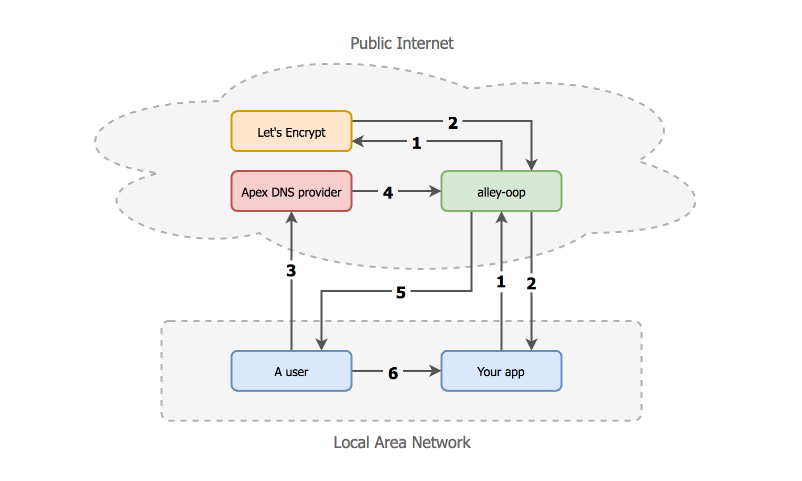
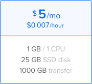
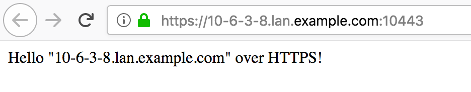
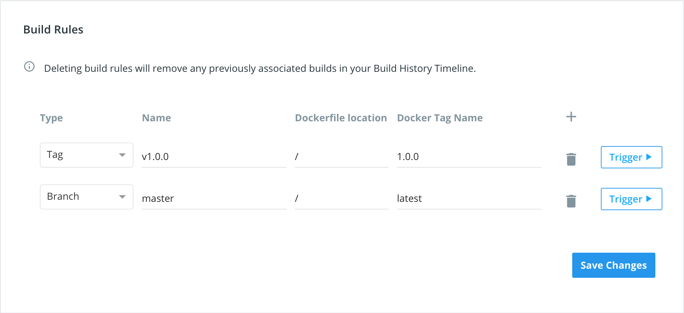

# Alley-Oop

An alley-oop is:

1. _In basketball, a shot where a player throws the ball up toward the rack, [and another player grabs it mid-air and performs a slam dunk](https://www.youtube.com/watch?v=cpfCd9fWq04)._
1. _In computer networking, a Dynamic DNS server with an integrated Let's Encrypt proxy, enabling easy HTTPS and WSS for web servers on a local network (LAN)._

## Sample use case

Say you're running some data logger, IoT device or home automation gateway on your LAN. You want it to be reachable over HTTPS or WSS (WebSocket Secure) because:

- You don't want other people on the same network to eavesdrop on you.
- You don't want other devices on the same network to pretend to be your device.
- If your device has a web UI for administration, you don't want scary "this is unsafe" banners in your browser. Also, some web platform features (such as Service Workers) are only available to sites served over HTTPS.
- If you have a web UI hosted on the internet, served over HTTPS, which makes XHR requests to other devices on your LAN, those requests also have to be made over HTTPS (otherwise those requests will be blocked due to [mixed content rules](https://developer.mozilla.org/en-US/docs/Web/Security/Mixed_content/How_to_fix_website_with_mixed_content) in modern browsers).

## How it works



1. You app contacts the `alley-oop` API with a domain name and IP pair, e.g. `my-app.lan.example.com` and `192.168.1.123`. The API is HTTPS-only, and requires authentication.
1. Let's Encrypt is asked to provision and verify an SSL certificate for the domain. The certificate and the corresponding private key are given to your app in the response.
1. When a user attempts a connection to `https://my-app.lan.example.com`, its DNS resolver first goes to the DNS provider of your apex domain (`example.com`), e.g. [Gandi](https://www.gandi.net/), [Hover](https://www.hover.com/), [Route 53](https://aws.amazon.com/route53/), etc.
1. The apex DNS provider tells the resolver that `lan.example.com` is managed by your `alley-oop` instance.
1. Your `alley-oop` resolves the query for `my-app.lan.example.com` to the LAN address `192.168.1.123`.
1. The user makes an HTTPS (or WSS) connection to your app within the LAN, and is greeted with a Let's Encrypt certificate that's valid for `https://my-app.lan.example.com`.

## Setup

This section describes getting a working demo set up. It uses `example.com` as the domain, but you should obviously **substitute that for your own domain** when going through the setup process.

1. [Getting a virtual machine](#1-getting-a-virtual-machine)
1. [Updating DNS records](#2-updating-dns-records)
1. [Preparing the machine](#3-preparing-the-machine)
1. [Running the alley-oop server](#4-running-the-alley-oop-server)
1. [Running the demo client](#5-running-the-demo-client)

### 1. Getting a virtual machine

This example will be creating a DigitalOcean droplet. You can of course **skip this step** if you already have a server you can use, or do something similar on another VPS host (e.g. Amazon EC2).

1. Create a new droplet
1. Select Docker from One-click apps, for example:

   

1. Even the cheapest droplet is plenty enough:

   

1. Make sure your SSH will be added to the machine
1. Choose a hostname, e.g. `alley-oop`
1. Create the droplet, and wait for it to be provisioned

### 2. Updating DNS records

Now, we need to make the host accessible via a domain name. Using your DNS provider of choice (e.g. [Gandi](https://www.gandi.net/), [Hover](https://www.hover.com/), [Route 53](https://aws.amazon.com/route53/), etc):

1. Create a DNS record that points to the server you just created in the previous step:

   ```
   Name:  alley-oop.example.com
   Type:  A
   Value: <IP address of the server>
   TTL:   300
   ```

1. Then, we need another record for our DNS server itself:

   ```
   Name:  lan.example.com.
   Type:  NS
   Value: alley-oop.example.com
   TTL:   300
   ```

Note that it might be tempting to have the `A` record name also be `lan.example.com`, but [due to DNS zone cuts](https://serverfault.com/a/779871), it's not possible.

### 3. Preparing the machine

We need to run a few commands on the host to make sure it can act as a DNS server. Feel free to adapt these to your particulars if you're running on a different distro, for example.

So SSH over, switch to `root`, and:

1. Open up standard HTTP(S) & DNS ports on the firewall:

   ```bash
   ufw allow 80/tcp
   ufw allow 443/tcp
   ufw allow 53/tcp
   ufw allow 53/udp
   ```

1. Disable the local DNS server, so it doesn't conflict with our new DNS server (i.e. `alley-oop`):

   ```bash
   systemctl stop systemd-resolved.service
   systemctl disable systemd-resolved.service
   ```

1. Use Google's DNS for local name resolution (or any other DNS host you prefer):

   ```bash
   echo 'nameserver 8.8.8.8' > /etc/resolv.conf
   ```

### 4. Running the `alley-oop` server

Finally, we need to configure and run `alley-oop` itself.

Using your favorite text editor (e.g. `vim`), create a file called `alley-oop.cfg` and update it to:

```ini
[auth]
username = "alley-oop"
password = "password"
[dns]
domain = "lan.example.com"
nsadmin = "admin.alley-oop.example.com"
nameservers = ["alley-oop.example.com"]
recordttl = 300
[db]
directory = "/var/lib/alley-oop"
```

**Please change the password to be a secret known only to you.** Seriously.

Now we're ready to pull and start the server itself:

```console
$ docker run --name alley-oop -d \
  -p 80:80 -p 443:443 -p 53:53/tcp -p 53:53/udp \
  -v "$(pwd)/alley-oop.cfg:/etc/alley-oop/config.cfg" \
  futurice/alley-oop:1.1.2
...
$ docker logs -f alley-oop
Starting alley-oop v1.1.2
Starting server at http://localhost:443
Starting DNS server at localhost:53
Starting server at http://localhost:80
^C
```

To check that the server is responding over the network, at the correct address, and with a valid certificate of its own, try:

```console
$ curl https://alley-oop.example.com/
alley-oop v1.1.2
```

### 5. Running the demo client

This repository ships with a demo client, which you can use to verify your server works as expected. Assuming you have a local IP address of `10.6.3.8`:

```console
$ cd demo
$ npm install
...
$ export DOMAIN_NAME=lan.example.com
$ export SERVER_NAME=alley-oop.example.com
$ export SERVER_PASSWORD=password
$ npm start
Current configuration is:

{ DOMAIN_NAME: 'lan.example.com',
  SERVER_NAME: 'alley-oop.example.com',
  SERVER_USERNAME: 'alley-oop',
  SERVER_PASSWORD: 'password',
  HTTP_PORT: 1080,
  HTTPS_PORT: 10443 }

Fetching https://alley-oop.example.com/v1/update?hostname=10-6-3-8.lan.example.com&myip=10.6.3.8

Server started! Try any of the following endpoints:

* http://10-6-3-8.lan.example.com:1080/
* https://10-6-3-8.lan.example.com:10443/
* ws://10-6-3-8.lan.example.com:1080/ws (test with http://www.websocket.org/echo.html)
* wss://10-6-3-8.lan.example.com:10443/ws (test with https://www.websocket.org/echo.html)

Fetching https://alley-oop.example.com/v1/privatekey?hostname=10-6-3-8.lan.example.com
Fetching https://alley-oop.example.com/v1/certificate?hostname=10-6-3-8.lan.example.com
```

While the server is running, you – and importantly, **anyone else on the same network** – should be greeted with a friendly, green padlock:



The demo client will register a DNS name for each private IP address available on your local interfaces. In practice, you'd more likely register a DNS entry with a more readable (and stable) name, like `my-app.lan.example.com`. The demo client can easily be adapted for that; for example:

```js
startServer({
  "my-app.lan.example.com": "192.168.1.123",
});
```

## Release

1. Ensure all docs have consistent example version (i.e. find & replace `1.1.2` in this repo)
1. Make sure all changes are pushed to GitHub `master`
1. Go on [GitHub](https://github.com/futurice/alley-oop/releases) and draft a new release with the format `v1.1.2`
1. Go on [Docker Hub](https://hub.docker.com/r/futurice/alley-oop/~/settings/automated-builds/), update the tag name, save, and use the "Trigger" button:

   
